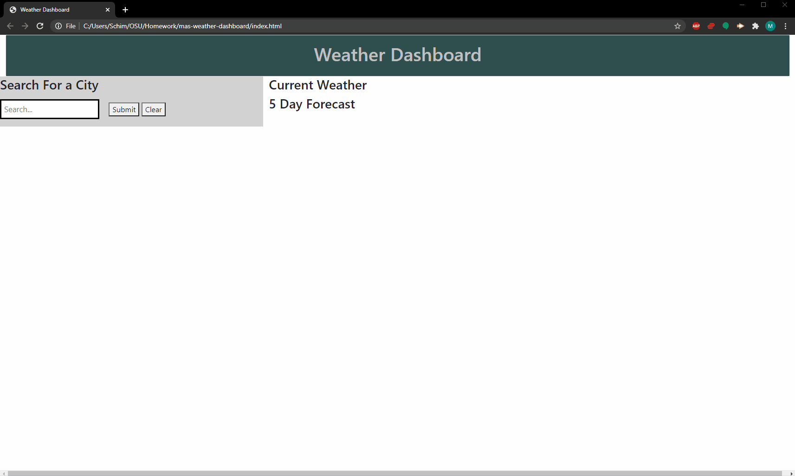

# mas-weather-dashboard

This project is designed to pull data from the openweathermap API. Uppon doing this the user will be presented with the current date and wetaher and 5 day forecast for the date and weather. Past searches will be stored in local storage and displayed below the search bar. A clear button will clear the searches and local storage.

[MAS Weather Dashboard](https://schimmoellerm.github.io/mas-weather-dashboard/)

## Instructions

1. The user is presented with an input bar search button and clear button
2. The user inputs a city name and clicks search. 
3. The user is presented with current weather information as well as a five day forecast for that location.
4. This location is stored in local storage and will display below the search bar.

## Built With

* [VSCode](https://code.visualstudio.com/) - Code editing software
* [GitBash](https://gitforwindows.org/) - Command line interface
* [moment.js](https://momentjs.com/) - Open source JS library that will Parse, validate, manipulate,
and display dates and times in JavaScript.
* [bootstrap](https://getbootstrap.com/) - Front end framework library for HTML and CSS.
* [jQuery] (https://jquery.com/) - JS library that simplifies JS and HTML interactions.
* [OpenWeatherMap API](https://openweathermap.org/current) - Open Weather Map API to pull weather data

## Authors

* **Mitch Schimmoeller** - *Programmer* - [Schimmoellerm](https://github.com/Schimmoellerm)

## Acknowledgments

* The OSU coding boot camp, its Instructor and TAs who fielded questions regarding this assignment.
* My fellow classmates for providing thoughts and ideas on how to get things working how id like.